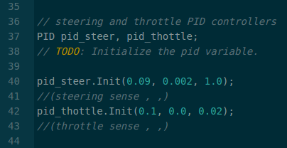
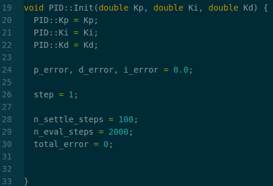
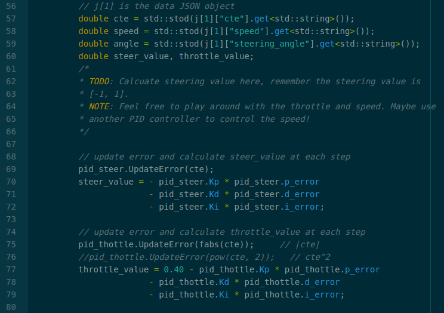
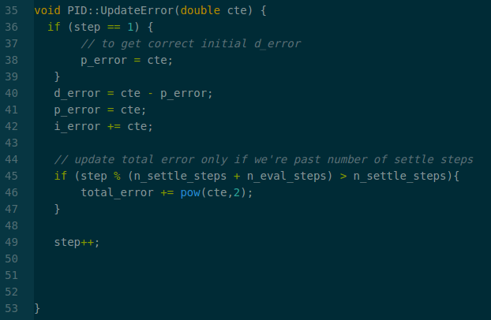
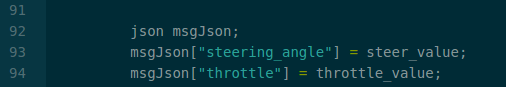

# CarND-Controls-PID
Self-Driving Car Engineer Nanodegree Program

---

## Files and Directorys


#### DIR /src

        main.cpp (contains PID controller, Connects to car sim via SocketIO, steering and throttle controls)

        PID.cpp (PID class to initialize variables, processes and update PID variables appropriable)

        PID.h (defined PID variables)

---

## Dependencies

* cmake >= 3.5
 * All OSes: [click here for installation instructions](https://cmake.org/install/)
* make >= 4.1(mac, linux), 3.81(Windows)
  * Linux: make is installed by default on most Linux distros
  * Mac: [install Xcode command line tools to get make](https://developer.apple.com/xcode/features/)
  * Windows: [Click here for installation instructions](http://gnuwin32.sourceforge.net/packages/make.htm)
* gcc/g++ >= 5.4
  * Linux: gcc / g++ is installed by default on most Linux distros
  * Mac: same deal as make - [install Xcode command line tools]((https://developer.apple.com/xcode/features/)
  * Windows: recommend using [MinGW](http://www.mingw.org/)
* [uWebSockets](https://github.com/uWebSockets/uWebSockets)
  * Run either `./install-mac.sh` or `./install-ubuntu.sh`.
  * If you install from source, checkout to commit `e94b6e1`, i.e.
    ```
    git clone https://github.com/uWebSockets/uWebSockets
    cd uWebSockets
    git checkout e94b6e1
    ```
    Some function signatures have changed in v0.14.x. See [this PR](https://github.com/udacity/CarND-MPC-Project/pull/3) for more details.
* Simulator. You can download these from the [project intro page](https://github.com/udacity/self-driving-car-sim/releases) in the classroom.

There's an experimental patch for windows in this [PR](https://github.com/udacity/CarND-PID-Control-Project/pull/3)


---

## PID & Code breakdown

### Code breakdown

The following code contains a implementation of a PID controller that controls a car in a simulator.

Initialize two PID controllers one for steering and for  throttle(velocity) with Hyperparameters discussed later on.

***main.cpp***

*Set Hyperparameters*



***PID.cpp***

*Initialize variables for PID controller*



----------

Get cte, car speed and car angle from simulator. Update PID error  variables with new cte. Also Calculate PID steer_value and throttle_value as output to car simulator.

***main.cpp***

*cte, speed and angle. Each PID applys UpdateError with the new cte value*



***PID.cpp***

*Calcuate error for each controller variable and calculate PID steering and throttle*



*Output steering and throttle*



### PID breakdown

**Three main parts of a PID controller**

#### Proportional
      Controller Variable which is proportional to the difference between the desired value (CTE).

#### Integral
     Controller Variable that describes displacement with the respect to velocity.

#### Derivative
    Controller Variable that measures the sensitivity to change of the output value.


#### Proportional controller

With just a proportional controller implemented the car will over shoot the cte then over correct (being marginally stable). The video below shows how a P controller over corrects.

<video width="620" height="440" controls>
  <source src="readmePic/p.mp4" type="video/mp4">
</video>


---

#### proportional-derivative controller

The use of both proportional and derivative controllers prevents over shooting and works quite well in the simulator. But one major problem is not having a bias, in the real world robots have biases, this is where the integral variable comes in PID. The Next Video Shows a successful loop around the track in a safe manner that doesn't incorporate a bias.

<video width="620" height="440" controls>
  <source src="readmePic/pd.mp4" type="video/mp4">
</video>


---

#### proportional-integral-derivative controller

The PID incorporates a biases (I) with a proportional-derivative controller which would simulate real world robots. The video below shows the finial implementation of the PID controller.

<video width="620" height="440" controls>
  <source src="readmePic/Finish.mp4" type="video/mp4">
</video>

---

## Hyperparameters

  First implementation of the Hyper-parameters where used from the lesson material. After implementing the integral variable, I then begin working on adjusting hyper-parameters, becoming satisfied when the car smoothed out and wouldn't jump off the track.

**Note** : When tuning steering PID throttle was set to 0.7 for a steady speed.

### Finial PID variables

##### Steering PID

    Proportional = 0.09
    Integral = 0.002
    Derivative = 1.0


##### Throttle PID

    Proportional = 0.1
    Integral = 0.0
    Derivative = 0.02

**Note** I found that each parameter has a cause and effect relation. Meaning if adjusting steering sensitivity (proportional) throttle parameters will be effected.

---
## Basic Build Instructions

1. Clone this repo.
2. Make a build directory: `mkdir build && cd build`
3. Compile: `cmake .. && make`
4. Run it: `./pid`.

Tips for setting up your environment can be found [here](https://classroom.udacity.com/nanodegrees/nd013/parts/40f38239-66b6-46ec-ae68-03afd8a601c8/modules/0949fca6-b379-42af-a919-ee50aa304e6a/lessons/f758c44c-5e40-4e01-93b5-1a82aa4e044f/concepts/23d376c7-0195-4276-bdf0-e02f1f3c665d)


## Prior problems

  My first implementation of the PID controller didn't work. Went back through the lesson and found pseudo code of a PID controller on wiki.
  Also I tried implementing a twiddle function to auto-tune Hyperparameters but found this to cause even more chaos. Found that self assigned Hyperparameters work great.

## Sources

**Udacity lesson material**

[Wikipedia](https://en.wikipedia.org/wiki/PID_controller)
